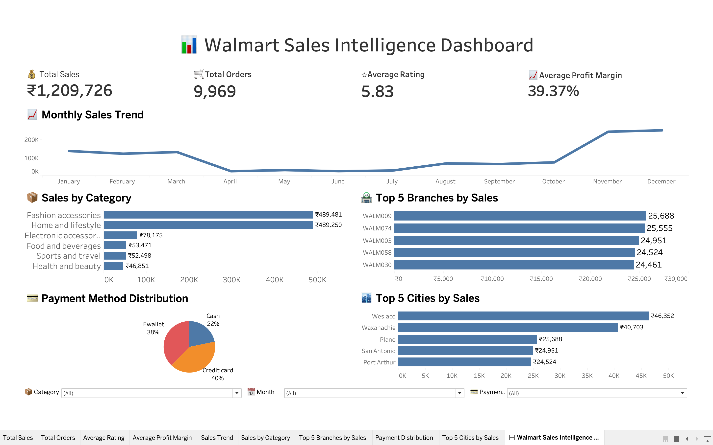

# 📊 Walmart Sales Intelligence Dashboard

> End-to-End Retail Sales Analytics Project using **Excel, Python, MySQL, and Tableau** to transform raw Walmart sales data into actionable business insights.


## 📑 Table of Contents

- [🌐 Live Dashboard](#-live-dashboard)
- [📖 Project Overview](#-project-overview)
- [📊 Dashboard Preview](#-dashboard-preview)
- [⭐ Project Highlights](#-project-highlights)
- [🛠 Tech Stack](#-tech-stack)
- [📁 Dataset](#-dataset)
- [🔄 Project Workflow](#-project-workflow)
- [📂 Project Structure](#-project-structure)
- [📒 Python Notebook](#-python-notebook)
- [SQL Analysis](#-sql-analysis)
- [🗄 SQL Queries Used for Dashboard](#-sql-queries-used-for-dashboard)
- [📊 Additional Business Analysis Queries](#-additional-business-analysis-queries)
- [🚀 Dashboard Features](#-dashboard-features)
- [💡 Business Insights](#-business-insights)
- [🎯 Business Impact](#-business-impact)
- [⚙️ Installation & Usage](#-installation-&-usage)
- [👨‍💻 Author](#-author)

## 🌐 Live Dashboard

🔗 **Interactive Tableau Public Dashboard**

https://public.tableau.com/views/Walmart_Sales_Intelligence_Dashboard/WalmartSalesIntelligenceDashboard


## 📌 Project Overview

The Walmart Sales Intelligence Dashboard is an end-to-end retail analytics project that transforms raw Walmart sales data into actionable business insights.

The project follows a complete analytics workflow, including data cleaning in Excel and Python, business analysis using MySQL, and interactive dashboard development in Tableau.

The dashboard enables users to monitor key performance indicators (KPIs), analyze monthly sales trends, evaluate product category performance, compare branch and city-wise sales, and understand customer payment preferences through interactive visualizations.


## 📷 Dashboard Preview


> Interactive Tableau dashboard showcasing KPIs, sales trends, category performance, branch analysis, city-wise sales, and payment method distribution.


## ⭐ Project Highlights

- ✅ End-to-End Retail Sales Analytics Project
- ✅ Data Cleaning using Excel & Python
- ✅ Business Analysis using MySQL
- ✅ Interactive Tableau Dashboard
- ✅ KPI-Based Business Intelligence Dashboard
- ✅ Business SQL Analysis
- ✅ Interactive Filters & Dynamic Visualizations
- ✅ Recruiter Portfolio Ready Project
  
  
## 🛠 Tech Stack

| Category | Tools |
|----------|-------|
|Programming | Python (Pandas, NumPy)
| Data Analysis | Pandas, NumPy |
| Database | MySQL |
| Visualization | Tableau |
| Version Control | Git & GitHub |
| Notebook | Jupyter Notebook |


## 📁 Dataset

The project uses Walmart retail sales transaction data.

Files included:

- Walmart.csv (Raw Dataset)
- walmart_clean_data.csv (Cleaned Dataset)


## 🔄 Project Workflow

```text
Raw Walmart Dataset (.csv)
            │
            ▼
 Data Cleaning & Preprocessing
        (Python + Pandas)
            │
            ▼
 Clean Dataset (.csv)
            │
            ├──────────────► MySQL
            │                     │
            │                     ▼
            │            Business SQL Queries
            │                     │
            ▼                     ▼
        Tableau Dashboard ◄──── Business Insights
            │
            ▼
 Interactive Data Visualization
```

## 📂 Project Structure

```text
walmart_sales_data_analytics/
│
├── Dashboard/
│   ├── dashboard.png
│   ├── README.md
│   └── walmart_sales_dashboard.twbx   (After Tableau Public export)
│
├── Dataset/
│   ├── Walmart.csv
│   ├── walmart_clean_data.csv
│   └── README.md
│
├── Docs/
│   ├── Walmart Business Problems.pdf
│   └── README.md
│
├── Notebook/
│   ├── project.ipynb
│   └── README.md
│
├── SQL/
│   ├── walmart_sales_queries.sql
│   └── README.md
│
├── README.md
├── requirements.txt
├── LICENSE
└── .gitignore

**### 📒 Python Notebook
**
The notebook includes:

- Data Cleaning
- Feature Engineering
- Exploratory Data Analysis
- Dataset Preparation for SQL

```
## SQL Analysis: Complex Queries and Business Problem Solving

### 🗄 SQL Queries Used for Dashboard:

    -- 💰 1. Total Sales KPI
```sql
    SELECT 
        ROUND(sum(total), 0) As Total_Sales
        FROM walmart;
```

    -- 🛒 2. Total Orders KPI
```sql
   SELECT 
      COUNT(invoice_id) As Total_Orders
      FROM walmart;
```
	-- ⭐ 3. Average Customer Rating KPI
```sql
 SELECT 
      ROUND(AVG(rating), 2) As Average_rating
      FROM walmart;
```
    -- 📈 4. Average Profit Margin KPI
```sql
  SELECT 
      ROUND(AVG(profit_margin) * 100, 2) As Average_profit_margin_percentage
      FROM walmart;
```
    -- 📅 5. Monthly Sales Trend
```sql
  SELECT
    MONTHNAME(STR_TO_DATE(date,'%d/%m/%y')) AS month,
    ROUND(SUM(total), 0) AS total_sales
FROM walmart
GROUP BY month
ORDER BY MIN(STR_TO_DATE(date,'%d/%m/%y'));
```
    -- 🛍️ 6. Sales by Product Category
```sql
  SELECT
      category,
      ROUND(SUM(total), 0) As total_sales
      FROM walmart
  GROUP BY category
  ORDER BY total_sales DESC;
```
    -- 🏪 7. Top 5 Branches by Sales
```sql
    SELECT 
        branch,
        ROUND(SUM(total), 0) As total_sales
        FROM walmart
	GROUP BY branch
    ORDER BY total_sales DESC
    LIMIT 5;
```
    -- 🌍 8. Top 5 Cities by Sales
```sql
   SELECT
        city,
        ROUND(SUM(total), 0) As total_sales
        FROM walmart
        GROUP BY city
        ORDER BY total_sales DESC
        LIMIT 5;
 ```
    -- 💳 9. Payment Method Distribution
```sql
   SELECT
        payment_method,
        ROUND(SUM(total), 0) As total_sales,
        ROUND(SUM(total) * 100 / (SELECT SUM(total) FROM walmart), 0) As sales_percentage
        FROM walmart
        GROUP BY payment_method
        ORDER BY total_sales DESC;
 ```
### 📊 Additional Business Analysis Queries
The following SQL queries were performed for additional business analysis and exploration.

    -- 10. Find different payment method and number of transactions, numberof qty sold?
```sql
SELECT DISTINCT payment_method as payment_method,
   COUNT(*) as no_transactions,
   SUM(quantity) as no_qty_sold
FROM walmart 
GROUP BY payment_method
ORDER BY payment_method;
```
    -- 11. Identify the highest-rated category in each branch, displaying the branch,category,AVG_rating
```sql     
SELECT *
FROM 
(  SELECT 
    branch,
    category,
    AVG(rating) as Average_rating,
    RANK() OVER(PARTITION BY branch ORDER BY AVG(rating) DESC ) as ranks
FROM walmart
GROUP BY branch,category
) as t1
WHERE ranks = 1;
```
	 -- 12. Revenue trends across branches and categories.
```sql
SELECT 
     category,
     city,
     MIN(rating) As min_rating,
     AVG(rating) As avg_rating,
     MAX(rating) As max_rating
	 FROM walmart
GROUP BY category,city;
```

     -- 13. Identifying best-selling product categories.
```sql
SELECT
     category,
     SUM(unit_price*quantity*profit_margin) As total_profit
     FROM walmart
GROUP BY category
ORDER BY total_profit DESC;
```
     -- 14. Sales performance by time, city, and payment method.
```sql
SELECT 
    city,
    payment_method,
    CASE 
       WHEN HOUR(time) < 12 THEN 'Morning'
       WHEN HOUR(time) BETWEEN 12 AND 17 THEN 'Afternoon'
       ELSE 'Evening'
    END As day_time,
    COUNT(*) As total_transactions,
    SUM(total) As total_sales
FROM walmart
GROUP BY city, payment_method, day_time
ORDER BY city, total_sales DESC;
```
    -- 15. Analyzing peak sales periods and customer buying patterns.
	 **a) Peak sales days**
```sql
SELECT 
    DAYNAME(STR_TO_DATE(date, '%d/%m/%y')) As day_name,
    COUNT(*) As total_transactions,
    SUM(total) As total_sales
FROM walmart
GROUP BY day_name
ORDER BY total_sales DESC;
```
     **b) Peak sales months**
```sql
SELECT 
    MONTHNAME(STR_TO_DATE(date, '%d/%m/%y')) As month_name,
    COUNT(*) As total_transactions,
    SUM(total) As total_sales
FROM walmart
GROUP BY month_name
ORDER BY total_sales DESC;
```
    **c) Peak sales hours**
```sql
SELECT 
    HOUR(time) As hour_of_day,
    COUNT(*) As total_transactions,
    SUM(total) As total_sales
FROM walmart
GROUP BY hour_of_day
ORDER BY total_sales DESC;
```
    **d) Average quantity purchased per transaction (by category)**
```sql
SELECT 
    category,
    AVG(quantity) As avg_qty_per_transaction,
    COUNT(*) As total_transactions
FROM walmart
GROUP BY category
ORDER BY avg_qty_per_transaction DESC;
```
    **e) Customer rating pattern (by category)**
```sql
SELECT 
    category,
    AVG(rating) As avg_rating,
    COUNT(*) As total_transactions
FROM walmart
GROUP BY category
ORDER BY avg_rating DESC;
```

     -- 16. Profit margin analysis by branch and category.
```sql
SELECT
    branch,
    category,
    SUM(unit_price * quantity) As total_revenue,
    SUM(unit_price * quantity * profit_margin) As total_profit,
    ROUND(AVG(profit_margin) * 100, 2) As avg_profit_margin_pct
    FROM walmart
GROUP BY branch,category
ORDER BY branch , total_profit DESC;
```
    -- 17. Identify 5 branches with highest decrease ratio in revenue comapare to last year (current year 2023 and last year 2022)
```sql
-- 2022 sales
WITH revenue_2022
As
   (    SELECT 
         branch,
         SUM(total) As revenue
         FROM walmart
        WHERE YEAR(STR_TO_DATE(date, '%d/%m/%y')) = 2022
        GROUP BY branch
        ORDER BY branch
	),
-- 2023 sales 
revenue_2023
As
   (    SELECT 
         branch,
         SUM(total) As revenue
         FROM walmart
        WHERE YEAR(STR_TO_DATE(date, '%d/%m/%y')) = 2023
        GROUP BY branch
        ORDER BY branch
	)

SELECT
     ls.branch,
     ls.revenue As ls_year_rev,
     cs.revenue As cs_year_rev,
     ROUND((ls.revenue - cs.revenue)/ls.revenue * 100, 2) As revenue_dec_ratio
FROM revenue_2022 As ls
JOIN revenue_2023 As cs
ON ls.branch = cs.branch
WHERE ls.revenue > cs.revenue
ORDER BY revenue_dec_ratio DESC
LIMIT 5;
```

## 🚀 Dashboard Features

✔ Interactive KPI Cards for quick business performance monitoring

✔ Monthly Sales Trend visualization to identify seasonal patterns

✔ Category-wise Sales Analysis for product performance comparison

✔ Top 5 Branches by Sales to identify high-performing stores

✔ Top 5 Cities by Sales to analyze regional business performance

✔ Payment Method Distribution to understand customer purchasing preferences

✔ Dynamic Filters (Category, Month, Payment Method) for customized business analysis

✔ Clean, responsive, and executive-level dashboard design suitable for business reporting

	
## 💡 Business Insights

- Identified seasonal sales peaks to support inventory planning and demand forecasting.
- Recognized top-performing product categories contributing the highest revenue.
- Highlighted high-performing branches and cities for regional performance analysis.
- Analyzed customer payment preferences to understand purchasing behavior.
- Monitored overall business health using interactive KPIs for Sales, Orders, Rating, and Profit Margin.
- Enabled dynamic exploration of business performance using Category, Month, and Payment Method filters.

  
 ## 🎯 Business Impact

This dashboard enables stakeholders to monitor sales performance and make data-driven business decisions through an interactive and user-friendly interface.

### Key Business Benefits

- 📈 Tracks overall business performance using real-time KPIs.
- 🛍 Identifies top-performing product categories for better inventory planning.
- 🏪 Highlights the highest revenue-generating branches and cities.
- 💳 Analyzes customer payment preferences to support business strategy.
- 📅 Detects monthly sales trends and seasonal demand patterns.
- 📊 Helps management evaluate profitability using the Average Profit Margin metric.
- 🎛 Allows dynamic filtering by Category, Month, and Payment Method for deeper analysis.
- 🚀 Supports faster decision-making with a centralized executive dashboard.


## ⚙️ Installation & Usage

### 1. Clone the repository

```bash
git clone https://github.com/Sumit6342/walmart_sales_data_analytics.git
```

### 2. Open the project

- Open the SQL scripts in **MySQL Workbench** (or any MySQL client).
- Load the Walmart dataset into your MySQL database.
- Execute the SQL queries to generate the required analysis.
- Open the Tableau workbook (.twb/.twbx) using **Tableau Public** or **Tableau Desktop**.
- Refresh the data source if required.

### 3. Explore the Dashboard

Use the interactive filters to analyze sales by:

- 📦 Product Category
- 📅 Month
- 💳 Payment Method

Interact with the charts to gain insights into:

- Monthly Sales Trend
- Sales by Category
- Top 5 Branches by Sales
- Top 5 Cities by Sales
- Payment Method Distribution
- Business KPIs (Sales, Orders, Rating, Profit Margin)

  ## 🌐 Live Dashboard

View the interactive Tableau dashboard here:

👉 https://public.tableau.com/views/Walmart_Sales_Intelligence_Dashboard/WalmartSalesIntelligenceDashboard

  
## 👨‍💻 Author

**Sumit Mallick**

Aspiring Data Analyst with a passion for transforming raw data into actionable business insights through SQL, Python, Excel, and Tableau.

### 📬 Connect with Me

- 💼 LinkedIn: [https://www.linkedin.com/in/YOUR-LINKEDIN-USERNAME](https://www.linkedin.com/in/sumit-mallick-ab96ab253/)
- 💻 GitHub: https://github.com/Sumit6342
- 📧 Email: sumit1610mallick@gmail.com

---

⭐ If you found this project helpful, consider giving this repository a **Star** on GitHub!
